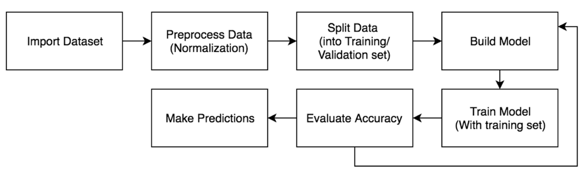

# MLproject
## Abstract
Music genre classification has a wide scope of applications and it has attracted the insterest of numerous researchers to tackle with the classification issue. Based on previous researches, machine learning techniques have proved to be able to identify trends from large pools of data, and ultimately classify the types of music. In this report, a music genre classification project is resolved based on a deep learning algorithm – Neural network. This project is developed in the python compiling environment and TensorFlow is applied as a tool. This paper first discusses the data source, including the class distribution and dimensionality analysis. Two models, Multilayer Perception (MLP) and Convolutional Neural network (CNN), were built to be trained in the project. The result of the two models was analyzed and evaluated for better performance. In the end, we suggest some methods for further improvement of classification.

## Data analysis
The original data for the music genre classification project is a training dataset with 4363 songs, and a test dataset with 6544 songs. For each song, it has 264 features which contain Rhythm Pattern, Chroma and MFCCs information. The feature vector of each song consists of 264 dimensions: 168 values for the rhythm patterns (24 bands, 7 statistics), 48 values for the chroma (12 bands, 4 statistics), and 48 values for the MFCCs (12 bands, 4 statistics). Based on the data source, the goal of this experiment is to classify these songs into 10 possible classes, which is determined based on different music genres.

## Process

